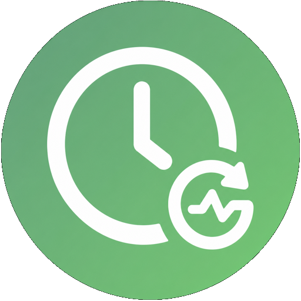

  

# Hourly Sensor

**Hourly Sensor** is a custom Home Assistant integration that creates rolling
statistics from one or more numeric sensor entities. Each configured sensor is
updated on the hour and keeps only the requested number of completed clock hours.

## ✨ Features

- Create any number of hourly sensors from the Home Assistant UI.
- Monitor any numeric `sensor` entity.
- Rolling windows from **1 to 168 completed hours**.
- Automatically removes the oldest hour; a 12-hour sensor discards hour 13.
- Statistics: cumulative change, sum, average, minimum, maximum, and last value.
- Handles cumulative meter resets when using **Change**.
- Dynamically inherits the monitored sensor's unit of measurement, device class,
  and state class, including when the source loads after the helper.
- Reports `0` instead of an unknown state until completed-hour data is available.
- Links the generated entity to the device that owns the monitored sensor.
- Persists internal hourly buckets across Home Assistant restarts.
- Exposes `average`, `minimum`, and `maximum` attributes calculated from all
  intermediate samples in the active completed-hour window.
- Preserves the most recently completed hour's value in the `last_period`
  attribute so delayed automations can still use it.
- Every hourly entity state is stored by Home Assistant's `recorder`, unless the
  entity is explicitly excluded from recording by the user.
- English and Spanish UI translations.

## 📋 Requirements

| Requirement | Minimum version |
|-------------|-----------------|
| Home Assistant | 2026.7.0 |
| HACS (optional) | 1.6.0 |
| Python (development/CI) | 3.14.2 |

## 📦 Installation

### HACS (recommended)

1. Open **HACS → Integrations**.
2. Open the three-dot menu → **Custom repositories**.
3. Add `https://github.com/Geek-MD/Hourly_Sensor` as **Integration**.
4. Search for **Hourly Sensor**, install it, and restart Home Assistant.

### Manual

1. Copy `custom_components/hourly_sensor` to
   `<config>/custom_components/hourly_sensor`.
2. Restart Home Assistant.

## ⚙️ Configuration

1. Go to **Settings → Devices & Services → Add Integration**.
2. Search for **Hourly Sensor**.
3. Choose a name, source sensor, statistic, rolling window, and precision.
4. Repeat **Add Integration** to create additional sensors.

### Statistics

| Statistic | Intended use | Rolling result |
|-----------|--------------|----------------|
| Change | Cumulative rain, water, energy, or other meter | Sum of positive changes; meter resets are handled |
| Sum | Sensors whose individual reports must be added | Sum of every sample received |
| Average | Temperature, humidity, pressure, etc. | Average of all samples |
| Minimum | Lowest observed value | Minimum of all samples |
| Maximum | Highest observed value | Maximum of all samples |
| Last | Value at the end of the latest completed hour | Latest sample |

Only completed clock hours contribute to the result. The current partial hour is
collected in the background and enters the window when the next hour begins.

## 💾 Persistence and history

Hourly buckets are saved with Home Assistant's versioned storage API. They are
restored when the integration reloads or Home Assistant restarts, so the rolling
window does not start over. The calculated entity is updated at every hour boundary;
those states are then persisted in Home Assistant's history database by `recorder`.

If the entity is listed under `recorder.exclude`, Home Assistant will intentionally
omit its history from the database. Remove that exclusion to retain its values.

## 🇪🇸 Resumen

Hourly Sensor crea sensores estadísticos con ventanas móviles de horas naturales
completas. Permite calcular cambio, suma, promedio, mínimo, máximo o último valor,
conserva sus buckets tras reinicios, registra cada actualización en el historial de
Home Assistant y asocia la entidad nueva al dispositivo del sensor de origen.

## 🗂️ Changelog

See [CHANGELOG.md](CHANGELOG.md).

## 📜 License

MIT License. See [LICENSE](LICENSE).

---

💻 **Proudly developed with GitHub Copilot and ChatGPT Codex** 🚀

